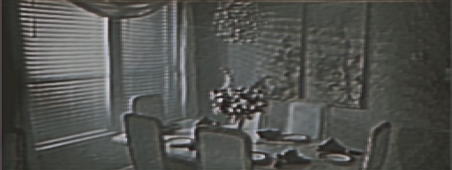

# De-hazer

🌥️ **Welcome to the De-hazing project!** 🌥️

This project focuses on utilizing machine learning techniques to remove haze and enhance visibility in images and videos. The core architecture used here is the UNet neural network, well-suited for image-to-image translation tasks.

## Basic Features

✨ **Key Features** ✨

- **Image De-Hazing:** The model is designed to remove haze and improve visibility in images and video frames.
- **Architecture:** This repository contains two different architectures to perform de-hazing: UNet and Pix2Pix.
- **Requirements:** Make sure you have TensorFlow, scikit-learn, OpenCV, and other dependencies installed (see requirements.txt).

## Getting Started

🚀 **Getting Started** 🚀

1. Clone this repository to your local machine:

   ```bash
   git clone https://github.com/rpaulwastaken/dehazer.git


2. Install required dependencies using the following command

   pip install -r requirements.txt

3. Make sure your Environment Variables are set correctly

## Trained Models
Here is a Google Drive link to the trained models: https://drive.google.com/drive/folders/1Uh8nfn4vCnb6XOZRrU2qhV-IaLTSqJNp?usp=sharing

## Sample Input Output

By enhancing the model architecture through the addition of supplementary layers and training it on high-performance dedicated GPUs, we can achieve outputs with significantly higher resolutions.  

### **Sample Input**


### **Sample Output U-Net**




### **Sample Output Pix2Pix**


